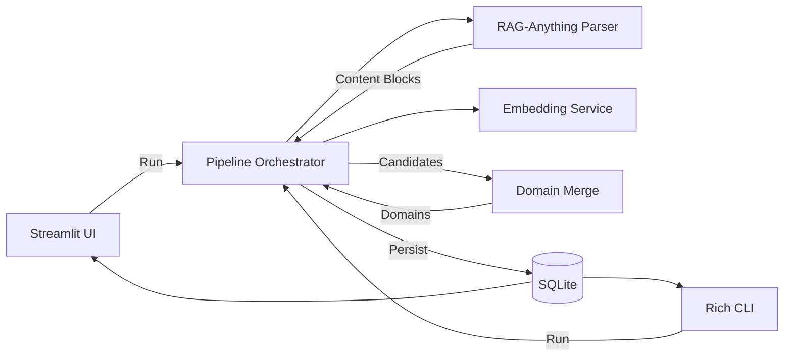

# Architecture Specification

## Overview
The system is a pipeline that ingests PDFs, extracts domain candidates, merges them into canonical domains, and produces embeddings. It exposes a CLI and a Streamlit UI.

## Components
- UI (Streamlit)
- CLI (Rich)
- Pipeline Orchestrator
- RAG-Anything Adapter
- Embedding Service (Azure OpenAI)
- SQLite Persistence
- Artifact Bundle Writer (see `docs/artifact_spec.md`)

## Data Flow (Mermaid)

## Storage
- All core entities and caches are stored in SQLite.
- Review queue is stored and applied as a hard constraint in merging.

## Interfaces
- UI and CLI call pipeline entrypoints only.
- Pipeline calls RAG-Anything for parsing.
- Pipeline calls Azure OpenAI for embeddings.

## Execution Model
- Pipeline execution is synchronous per run; no background jobs or daemons.
